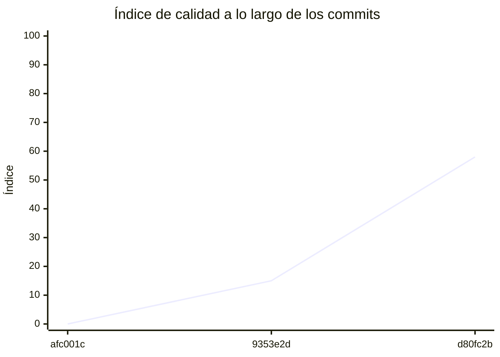

<!-- evaluacion:inicio -->
# Evaluación — Vicen-CaraTapia/catalog-sync-service

> Documento **generado automáticamente** por la cátedra de Programación II (UM): RepoSense + análisis de calidad de **7 dimensiones**. **No editar a mano**: se regenera en cada evaluación.
> Rama evaluada: `main`. Análisis **heurístico** (regex + métricas) + build: es una criba para orientar la revisión, **no una nota**. La **documentación** del repositorio no se evalúa.
> Generado: 2026-11-17.

## 1. Veredicto

| Aspecto | Resultado |
|---|---|
| Índice de calidad | **70/100** |
| Tipo de repositorio | `backend` |
| Build (`mvnw verify` / `gradlew check`) | OK |
| Código (LOC) | 10,703 |
| Archivos de código | 179 |
| Clases | 201 |
| Código dentro de clases (%POO) | 79% |
| Funciones fuera de clases | 0 |
| Duplicación (puerta) | 6.7% |
| Duplicación lógica | 7.0% |
| Duplicación de boilerplate | 7.0% |
| Cobertura | 98% |
| Tope duro aplicado a D1 | `POO_BAJO` → D1 ≤ 60 |

> Este informe **describe** lo que el análisis midió con los criterios ya establecidos de la materia. No es una nota.

## 2. Semáforo de aprobación

Criterios de la cátedra (`CRITERIOS-CALIDAD.md`): **Aprobar** se juega con el perfil `estandar`; **destacar**, con el `exigente` (meta de excelencia).

| Semáforo | Resultado |
|---|---|
| Aprobar (`estandar`) | **no cumple** — 6/11 |
| Destacar (`exigente`) | **no cumple** — 5/11 |

**Para aprobar, falta cumplir:** SOLID; Duplicación

**Para destacar, falta cumplir:** SOLID; POO; Duplicación

## 3. Autoría (RepoSense)

| Autor | Commits | Código (LOC) | Tests (LOC) | Docs (LOC) | Días activos | % del código |
|---|---:|---:|---:|---:|---:|---:|
| Vicente Cara Tapia | 54 | 3,845 | 8,838 | 252 | 14 | 100% |

> _El LOC de autoría lo calcula RepoSense sobre el historial y puede diferir del LOC de código del análisis (que mira el estado de `main`)._

## 4. Dimensiones evaluadas

Cada dimensión indica **qué mide**, **por qué importa** y **tu resultado**. Cuando el puntaje queda por debajo de la referencia, se agregan preguntas para **investigar la causa** (no hay recetas).

| Dimensión | Peso | Puntaje |
|:--|--:|--:|
| **D1** Diseño OO, SOLID y patrones (20%) | 20% | 5 |
| **D2** Arquitectura hexagonal — backend (15%) | 15% | 100 |
| **D3** Frontend KMP: MVVM y buenas prácticas (10%) | 10% | N/A |
| **D4** Integración y contrato (10%) | 10% | 50 |
| **D5** Seguridad y robustez (10%) | 10% | 100 |
| **D6** Pruebas y cobertura (20%) | 20% | 100 |
| **D7** Proceso y entrega (15%) | 15% | 77 |

### D1. Diseño OO, SOLID y patrones (20%)

- **Qué mide:** Métricas orientadas a objetos (clases, métodos, campos, cohesión, acoplamiento, herencia) y proxies de SOLID, más patrones de diseño.
- **Por qué importa:** El eje de la materia es el buen uso de la POO y su arquitectura: un diseño con clases claras y poco acopladas es más fácil de entender, probar y cambiar.
- **Tu resultado:** **5/100**
- **Para investigar la causa:**
    - ¿Se pensó el modelo de clases antes de codificar o se agrupó después?
    - ¿Qué clases concentran muchas responsabilidades a la vez?
    - ¿Los colaboradores llegan como parámetros o se crean por dentro?

### D2. Arquitectura hexagonal — backend (15%)

- **Qué mide:** Separación en capas (dominio, puertos de entrada/salida, adaptadores) y dirección de las dependencias del backend.
- **Por qué importa:** Aislar el dominio de la infraestructura permite cambiar la base de datos, el framework o el transporte sin tocar las reglas de negocio.
- **Tu resultado:** **100/100**

### D4. Integración y contrato (10%)

- **Qué mide:** Cumplimiento del contrato de integración de la cátedra (formato de errores, paginación, autenticación, endpoints esperados).
- **Por qué importa:** Los servicios deben poder integrarse entre sí y con la app sin sorpresas; el contrato es lo que hacen cumplir las pruebas de integración.
- **Tu resultado:** **50/100**
- **Para investigar la causa:**
    - ¿Qué endpoints difieren del contrato acordado?
    - ¿Los errores se devuelven con un formato uniforme?
    - ¿La autenticación es consistente entre servicios?

### D5. Seguridad y robustez (10%)

- **Qué mide:** Credenciales embebidas, consultas SQL por concatenación, y presencia de config de entorno; aislamiento de secretos.
- **Por qué importa:** Un secreto en el repositorio o una consulta construida por concatenación son riesgos concretos, no hipotéticos.
- **Tu resultado:** **100/100**

### D6. Pruebas y cobertura (20%)

- **Qué mide:** Cantidad y resultado de pruebas y cobertura de línea (JaCoCo/Kover, Surefire/Failsafe) cuando hay build.
- **Por qué importa:** Las pruebas son la red de seguridad para refactorizar e integrar; la cobertura acota las zonas sin verificar.
- **Tu resultado:** **100/100**

### D7. Proceso y entrega (15%)

- **Qué mide:** Artefactos verificables de proceso/entrega: `compose`, `.env.example`, CI (`.github/workflows/`), `CODEOWNERS` y wrapper de build (`mvnw`/`gradlew`). **No** puntúa documentación.
- **Por qué importa:** Un proyecto que compila, se levanta y se valida solo es más fácil de revisar y de integrar en equipo.
- **Tu resultado:** **77/100**

## 5. Señales detectadas

El análisis encontró las siguientes señales (archivo, sin número de línea a propósito):

**SRP/responsabilidad** (17)
- clase 'CatedraRedisCatalogDecoder' grande (LOC=191, métodos=25, campos=1) — `src/main/java/ar/edu/um/prog2/catalogsync/synchronization/infrastructure/redis/decoder/CatedraRedisCatalogDecoder.java`
- clase 'CatedraRedisClient' grande (LOC=90, métodos=13, campos=8) — `src/main/java/ar/edu/um/prog2/catalogsync/synchronization/infrastructure/redis/client/CatedraRedisClient.java`
- clase 'CatedraRedisClient' con baja cohesión (40%) — `src/main/java/ar/edu/um/prog2/catalogsync/synchronization/infrastructure/redis/client/CatedraRedisClient.java`
- clase 'CatedraRedisCatalogChangesAdapter' grande (LOC=69, métodos=15, campos=2) — `src/main/java/ar/edu/um/prog2/catalogsync/synchronization/infrastructure/redis/adapter/CatedraRedisCatalogChangesAdapter.java`
- clase 'CatalogUpdatedListener' sin métodos (4 campos): solo datos — `src/main/java/ar/edu/um/prog2/catalogsync/synchronization/infrastructure/kafka/listener/CatalogUpdatedListener.java`
- método 'SynchronizationRetryExecutor.execute' de 35 líneas — `src/main/java/ar/edu/um/prog2/catalogsync/synchronization/infrastructure/retry/SynchronizationRetryExecutor.java`
- método 'SynchronizationRetryExecutor.execute' con complejidad 8 — `src/main/java/ar/edu/um/prog2/catalogsync/synchronization/infrastructure/retry/SynchronizationRetryExecutor.java`
- método 'CatalogVersionSynchronizationService.synchronizeTo' de 37 líneas — `src/main/java/ar/edu/um/prog2/catalogsync/synchronization/application/service/CatalogVersionSynchronizationService.java`
- método 'CatalogVersionSynchronizationService.synchronizeTo' con complejidad 10 — `src/main/java/ar/edu/um/prog2/catalogsync/synchronization/application/service/CatalogVersionSynchronizationService.java`
- clase 'CatalogPersistenceMapper' grande (LOC=72, métodos=12, campos=0) — `src/main/java/ar/edu/um/prog2/catalogsync/catalog/infrastructure/persistence/mapper/CatalogPersistenceMapper.java`
- clase 'JpaCatalogSnapshotPersistenceAdapter' con baja cohesión (17%) — `src/main/java/ar/edu/um/prog2/catalogsync/catalog/infrastructure/persistence/adapter/JpaCatalogSnapshotPersistenceAdapter.java`
- método 'JpaCatalogSnapshotPersistenceAdapter.apply' de 48 líneas — `src/main/java/ar/edu/um/prog2/catalogsync/catalog/infrastructure/persistence/adapter/JpaCatalogSnapshotPersistenceAdapter.java`
- clase 'CatalogSyncStateEntity' con baja cohesión (40%) — `src/main/java/ar/edu/um/prog2/catalogsync/catalog/infrastructure/persistence/entity/CatalogSyncStateEntity.java`
- clase 'ProfessionalCategoryEntity' con baja cohesión (0%) — `src/main/java/ar/edu/um/prog2/catalogsync/catalog/infrastructure/persistence/entity/ProfessionalCategoryEntity.java`
- clase 'WeeklyScheduleEntity' grande (LOC=71, métodos=10, campos=9) — `src/main/java/ar/edu/um/prog2/catalogsync/catalog/infrastructure/persistence/entity/WeeklyScheduleEntity.java`
- clase 'WeeklyScheduleEntity' con baja cohesión (0%) — `src/main/java/ar/edu/um/prog2/catalogsync/catalog/infrastructure/persistence/entity/WeeklyScheduleEntity.java`
- clase 'ProfessionalEntity' con baja cohesión (0%) — `src/main/java/ar/edu/um/prog2/catalogsync/catalog/infrastructure/persistence/entity/ProfessionalEntity.java`

**DIP/concretos** (32)
- clase 'CatedraRedisCatalogDecoder' muy acoplada (CBO=16) — `src/main/java/ar/edu/um/prog2/catalogsync/synchronization/infrastructure/redis/decoder/CatedraRedisCatalogDecoder.java`
- clase 'CatedraRedisCatalogDecoder' instancia 7 concretos (CBO=16) — `src/main/java/ar/edu/um/prog2/catalogsync/synchronization/infrastructure/redis/decoder/CatedraRedisCatalogDecoder.java`
- clase 'CatedraRedisClient' muy acoplada (CBO=8) — `src/main/java/ar/edu/um/prog2/catalogsync/synchronization/infrastructure/redis/client/CatedraRedisClient.java`
- clase 'CatedraRedisClient' instancia 4 concretos (CBO=8) — `src/main/java/ar/edu/um/prog2/catalogsync/synchronization/infrastructure/redis/client/CatedraRedisClient.java`
- clase 'CatedraRedisCatalogChangesAdapter' muy acoplada (CBO=13) — `src/main/java/ar/edu/um/prog2/catalogsync/synchronization/infrastructure/redis/adapter/CatedraRedisCatalogChangesAdapter.java`
- clase 'CatedraRedisCatalogChangesAdapter' instancia 5 concretos (CBO=13) — `src/main/java/ar/edu/um/prog2/catalogsync/synchronization/infrastructure/redis/adapter/CatedraRedisCatalogChangesAdapter.java`
- clase 'CatalogReconciliationRunner' muy acoplada (CBO=11) — `src/main/java/ar/edu/um/prog2/catalogsync/synchronization/infrastructure/startup/CatalogReconciliationRunner.java`
- clase 'CatedraRestClient' muy acoplada (CBO=20) — `src/main/java/ar/edu/um/prog2/catalogsync/synchronization/infrastructure/rest/client/CatedraRestClient.java`
- clase 'CatedraRestClient' instancia 5 concretos (CBO=20) — `src/main/java/ar/edu/um/prog2/catalogsync/synchronization/infrastructure/rest/client/CatedraRestClient.java`
- clase 'CatedraCatalogListenerStarter' muy acoplada (CBO=8) — `src/main/java/ar/edu/um/prog2/catalogsync/synchronization/infrastructure/kafka/startup/CatedraCatalogListenerStarter.java`
- clase 'CatalogUpdatedListener' muy acoplada (CBO=9) — `src/main/java/ar/edu/um/prog2/catalogsync/synchronization/infrastructure/kafka/listener/CatalogUpdatedListener.java`
- clase 'CatalogUpdatedEventDecoder' muy acoplada (CBO=8) — `src/main/java/ar/edu/um/prog2/catalogsync/synchronization/infrastructure/kafka/decoder/CatalogUpdatedEventDecoder.java`
- clase 'CatedraKafkaConnectivityVerifier' muy acoplada (CBO=13) — `src/main/java/ar/edu/um/prog2/catalogsync/synchronization/infrastructure/kafka/verification/CatedraKafkaConnectivityVerifier.java`
- clase 'CatedraKafkaConfiguration' muy acoplada (CBO=13) — `src/main/java/ar/edu/um/prog2/catalogsync/synchronization/infrastructure/kafka/config/CatedraKafkaConfiguration.java`
- clase 'ProcessedCatalogEventJpaRepository' muy acoplada (CBO=9) — `src/main/java/ar/edu/um/prog2/catalogsync/synchronization/infrastructure/persistence/repository/ProcessedCatalogEventJpaRepository.java`
- clase 'JpaProcessedCatalogEventAdapter' muy acoplada (CBO=11) — `src/main/java/ar/edu/um/prog2/catalogsync/synchronization/infrastructure/persistence/adapter/JpaProcessedCatalogEventAdapter.java`
- clase 'JpaCatalogIncrementalPersistenceAdapter' muy acoplada (CBO=10) — `src/main/java/ar/edu/um/prog2/catalogsync/synchronization/infrastructure/persistence/adapter/JpaCatalogIncrementalPersistenceAdapter.java`
- clase 'SynchronizationRetryExecutor' muy acoplada (CBO=13) — `src/main/java/ar/edu/um/prog2/catalogsync/synchronization/infrastructure/retry/SynchronizationRetryExecutor.java`
- clase 'SynchronizationRetryExecutor' instancia 3 concretos (CBO=13) — `src/main/java/ar/edu/um/prog2/catalogsync/synchronization/infrastructure/retry/SynchronizationRetryExecutor.java`
- clase 'TransientSynchronizationFailureClassifier' muy acoplada (CBO=35) — `src/main/java/ar/edu/um/prog2/catalogsync/synchronization/infrastructure/retry/TransientSynchronizationFailureClassifier.java`
- clase 'CatalogVersionSynchronizationService' muy acoplada (CBO=10) — `src/main/java/ar/edu/um/prog2/catalogsync/synchronization/application/service/CatalogVersionSynchronizationService.java`
- clase 'CatalogVersionSynchronizationService' instancia 4 concretos (CBO=10) — `src/main/java/ar/edu/um/prog2/catalogsync/synchronization/application/service/CatalogVersionSynchronizationService.java`
- clase 'ReconcileCatalogStateUseCaseImpl' muy acoplada (CBO=9) — `src/main/java/ar/edu/um/prog2/catalogsync/synchronization/application/usecases/ReconcileCatalogStateUseCaseImpl.java`
- clase 'CatalogInitializationRunner' muy acoplada (CBO=11) — `src/main/java/ar/edu/um/prog2/catalogsync/catalog/infrastructure/startup/CatalogInitializationRunner.java`
- clase 'CatedraCatalogSnapshotMapper' muy acoplada (CBO=10) — `src/main/java/ar/edu/um/prog2/catalogsync/catalog/infrastructure/rest/snapshot/mapper/CatedraCatalogSnapshotMapper.java`
- clase 'CatedraCatalogSnapshotMapper' instancia 5 concretos (CBO=10) — `src/main/java/ar/edu/um/prog2/catalogsync/catalog/infrastructure/rest/snapshot/mapper/CatedraCatalogSnapshotMapper.java`
- clase 'JpaCatalogSnapshotPersistenceAdapter' muy acoplada (CBO=16) — `src/main/java/ar/edu/um/prog2/catalogsync/catalog/infrastructure/persistence/adapter/JpaCatalogSnapshotPersistenceAdapter.java`
- clase 'JpaCatalogSnapshotPersistenceAdapter' instancia 3 concretos (CBO=16) — `src/main/java/ar/edu/um/prog2/catalogsync/catalog/infrastructure/persistence/adapter/JpaCatalogSnapshotPersistenceAdapter.java`
- clase 'JpaProfessionalSearchAdapter' muy acoplada (CBO=14) — `src/main/java/ar/edu/um/prog2/catalogsync/catalog/infrastructure/persistence/adapter/JpaProfessionalSearchAdapter.java`
- clase 'JpaProfessionalDetailsAdapter' muy acoplada (CBO=10) — `src/main/java/ar/edu/um/prog2/catalogsync/catalog/infrastructure/persistence/adapter/JpaProfessionalDetailsAdapter.java`
- clase 'ProfessionalSearchController' muy acoplada (CBO=11) — `src/main/java/ar/edu/um/prog2/catalogsync/catalog/infrastructure/web/controller/ProfessionalSearchController.java`
- clase 'ProfessionalSearchController' instancia 3 concretos (CBO=11) — `src/main/java/ar/edu/um/prog2/catalogsync/catalog/infrastructure/web/controller/ProfessionalSearchController.java`

**?** (7)
- clase 'InvalidCatedraRedisDataException' con herencia profunda (DIT=2) — `src/main/java/ar/edu/um/prog2/catalogsync/synchronization/infrastructure/redis/exception/InvalidCatedraRedisDataException.java`
- clase 'CatedraRedisUnavailableException' con herencia profunda (DIT=2) — `src/main/java/ar/edu/um/prog2/catalogsync/synchronization/infrastructure/redis/exception/CatedraRedisUnavailableException.java`
- clase 'CatedraRedisAccessException' con herencia profunda (DIT=2) — `src/main/java/ar/edu/um/prog2/catalogsync/synchronization/infrastructure/redis/exception/CatedraRedisAccessException.java`
- clase 'CatedraHttpException' con herencia profunda (DIT=2) — `src/main/java/ar/edu/um/prog2/catalogsync/synchronization/infrastructure/rest/exception/CatedraHttpException.java`
- clase 'CatedraTimeoutException' con herencia profunda (DIT=2) — `src/main/java/ar/edu/um/prog2/catalogsync/synchronization/infrastructure/rest/exception/CatedraTimeoutException.java`
- clase 'CatedraTransportException' con herencia profunda (DIT=2) — `src/main/java/ar/edu/um/prog2/catalogsync/synchronization/infrastructure/rest/exception/CatedraTransportException.java`
- clase 'InvalidCatalogSnapshotException' con herencia profunda (DIT=2) — `src/main/java/ar/edu/um/prog2/catalogsync/catalog/infrastructure/rest/snapshot/exception/InvalidCatalogSnapshotException.java`

**OCP/type-switch** (3)
- clase 'CatedraRestClient' con 3 type-checks — `src/main/java/ar/edu/um/prog2/catalogsync/synchronization/infrastructure/rest/client/CatedraRestClient.java`
- clase 'CatedraKafkaConnectivityVerifier' con 3 type-checks — `src/main/java/ar/edu/um/prog2/catalogsync/synchronization/infrastructure/kafka/verification/CatedraKafkaConnectivityVerifier.java`
- clase 'TransientSynchronizationFailureClassifier' con 35 type-checks — `src/main/java/ar/edu/um/prog2/catalogsync/synchronization/infrastructure/retry/TransientSynchronizationFailureClassifier.java`

**POO** (1)
- clase 'CatalogSnapshotResponse' solo con métodos estáticos (¿utilitaria?) — `src/main/java/ar/edu/um/prog2/catalogsync/catalog/infrastructure/rest/snapshot/dto/CatalogSnapshotResponse.java`

**duplicación** (6)
- duplicación lógica: 6.7% · boilerplate: 7.0%
- bloque de 8 líneas repetido 7 veces en src/test/java/ar/edu/um/prog2/catalogsync/config/CatedraIntegrationPropertiesValidationTest.java:29, src/test/java/ar/edu/um/prog2/catalogsync/config/CatedraIntegrationPropertiesValidationTest.java:30, src/test/java/ar/edu/um/prog2/catalogsync/config/CatedraIntegrationPropertiesValidationTest.java:31 — `src/test/java/ar/edu/um/prog2/catalogsync/config/CatedraIntegrationPropertiesValidationTest.java`
- bloque de 8 líneas repetido 3 veces en src/test/java/ar/edu/um/prog2/catalogsync/synchronization/infrastructure/rest/client/CatedraRestClientTest.java:216, src/test/java/ar/edu/um/prog2/catalogsync/catalog/infrastructure/rest/snapshot/client/CatedraCatalogSnapshotClientTest.java:225, src/test/java/ar/edu/um/prog2/catalogsync/config/CatedraIntegrationPropertiesValidationTest.java:66 — `src/test/java/ar/edu/um/prog2/catalogsync/synchronization/infrastructure/rest/client/CatedraRestClientTest.java`
- bloque de 8 líneas repetido 3 veces en src/test/java/ar/edu/um/prog2/catalogsync/synchronization/infrastructure/rest/client/CatedraRestClientTest.java:218, src/test/java/ar/edu/um/prog2/catalogsync/catalog/infrastructure/rest/snapshot/client/CatedraCatalogSnapshotClientTest.java:227, src/test/java/ar/edu/um/prog2/catalogsync/config/CatedraIntegrationPropertiesValidationTest.java:68 — `src/test/java/ar/edu/um/prog2/catalogsync/synchronization/infrastructure/rest/client/CatedraRestClientTest.java`
- bloque de 8 líneas repetido 3 veces en src/test/java/ar/edu/um/prog2/catalogsync/synchronization/infrastructure/rest/client/CatedraRestClientTest.java:220, src/test/java/ar/edu/um/prog2/catalogsync/catalog/infrastructure/rest/snapshot/client/CatedraCatalogSnapshotClientTest.java:229, src/test/java/ar/edu/um/prog2/catalogsync/config/CatedraIntegrationPropertiesValidationTest.java:70 — `src/test/java/ar/edu/um/prog2/catalogsync/synchronization/infrastructure/rest/client/CatedraRestClientTest.java`
- bloque de 8 líneas repetido 3 veces en src/test/java/ar/edu/um/prog2/catalogsync/synchronization/infrastructure/rest/client/CatedraRestClientTest.java:221, src/test/java/ar/edu/um/prog2/catalogsync/catalog/infrastructure/rest/snapshot/client/CatedraCatalogSnapshotClientTest.java:230, src/test/java/ar/edu/um/prog2/catalogsync/config/CatedraIntegrationPropertiesValidationTest.java:71 — `src/test/java/ar/edu/um/prog2/catalogsync/synchronization/infrastructure/rest/client/CatedraRestClientTest.java`

## 6. Evolución por commit

Métricas calculadas sobre el estado de `main` en **cada commit** (3 commits con trabajo), del primero al último. La calidad usa el perfil `exigente`; el aporte de código lo mide RepoSense. El índice puede **bajar** al crecer el proyecto: se acumulan señales.

```mermaid
xychart-beta
    title "Índice de calidad a lo largo de los commits"
    x-axis ["afc001c", "9353e2d", "d80fc2b"]
    y-axis "Índice" 0 --> 100
    line [0, 15, 58]
```

| # | Fecha | Commit | Autor | LOC | Índice | %POO | Duplic. | Sueltas |
|---|---|---|---|---:|---:|---:|---:|---:|
| 1 | 2026-09-14 | `afc001c` | Ing. Daniel Quinteros | 0 | 0 | 0% | 0.0% | 0 |
| 2 | 2026-09-14 | `9353e2d` | Ing. Daniel Quinteros | 0 | 15 | 0% | 0.0% | 0 |
| 3 | 2026-11-05 | `d80fc2b` | Vicente Cara Tapia | 10,703 | 58 | 79% | 6.7% | 0 |

---
_Informe generado por la cátedra. Las dimensiones y umbrales corresponden a `calidad.py` (perfil `exigente`); el semáforo, a `CRITERIOS-CALIDAD.md`. La documentación del repositorio no se evalúa. Ante dudas, revisá el archivo señalado._
<!-- evaluacion:fin -->
